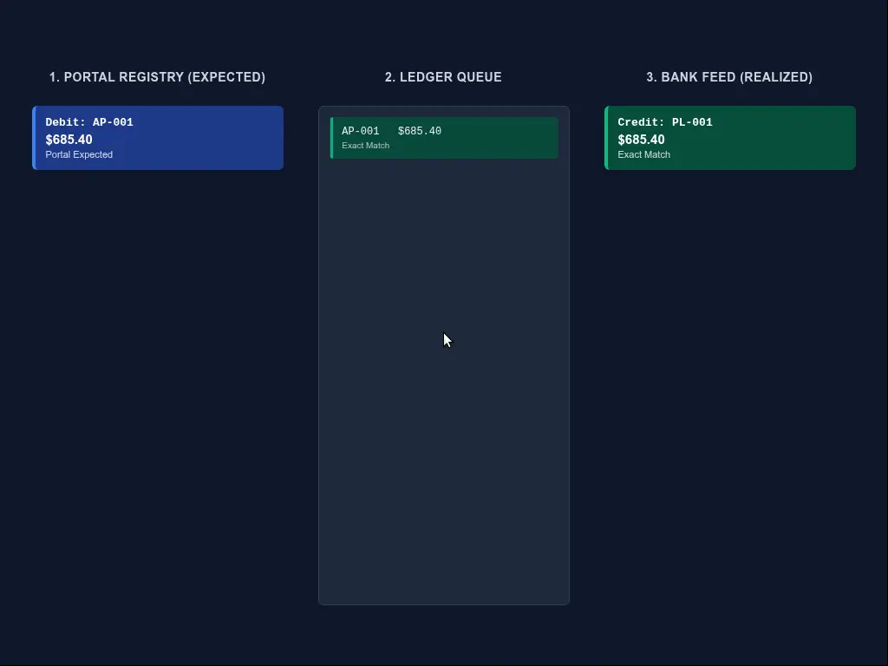
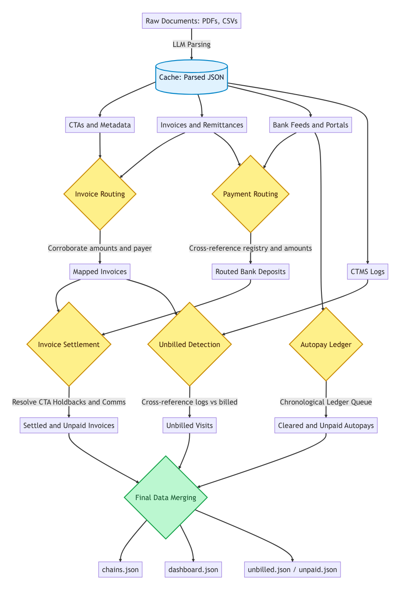
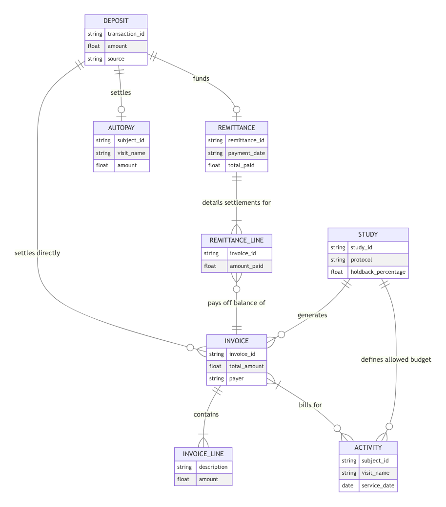

<h1 align="center">Clinical Trial Reconciliation Engine</h1>

## Quick Start

**To run**
```bash
make reconcile
```
This command assumes the initial `documents/` have been extracted using `extractor.py` (using a LLM to parse the text/images) to get their JSON representations which are stored in `cache/`. It executes the domain logic and writes the  outputs to the `out/` directory as per the schema.

**To run the conformance checker:**
```bash
make selfcheck
```

## Data Model & Architecture

The overall code flow in main is as follows:

1. **Load the parsed data**:  store the parsed CTA and corresponding metadata. The rest of the documents (invoices, remittances, bank feed, comms) already have a assigned type from the LLM parsing

2. **Invoice -> Study**: Invoices are linked to corresponding studies. The engine extracts the study-id and cross-references the content (payer, billed amounts) with the CTA. In case of a mismatch where the payer and amounts align with a different study, the engine detects it as a misfile and correctly routes it.

3. **Payments -> Study/Remittance**:  The bank deposits are cross-referenced against payment portal registries (Ledger Run, Ramp) by amount and date proximity (within 5 days) and are matched to remittances matching line by line and date proximity. In case of a remittance match, the study associated with this payment is extracted from the invoice item being remitted. If there is no remittance, the engine tries to match directly against known invoice amounts and or sponsor/payer. Deposits predating the CTA effective date or lacking any valid remittance/autopay routing are discarded.

4. **Invoice -> Payments**: Invoices are matched to their corresponding bank deposits by checking if their ID appears within a deposit's matched remittance lines. The engine scans Slack/email comms to flag invoices definitively reported as disputed or unpaid (status determined by LLM)

5. **Autopays -> Payments**: The engine reconciles autopays using a chronological Credit/Debit Ledger queue. Every scheduled autopay in the portal is logged as an Expected Debit, and every unassigned deposit in the bank feed is logged as a Realized Credit. The engine sorts these chronologically and attempts to pop matching Debits against incoming Credits. If a Debit ages without a corresponding Credit, it is flagged as Unpaid depicted below



6. **Unbilled Revenue Detection**: The engine loops through every single visit log in the CTMS exports, and scans all processed invoices. If a visit has no corresponding invoice referencing its subject ID and visit name, and the CTA dictates that it should be billable, it is added to the unbilled revenue tracker.

7. **Final Report Generation**: The engine iterates through these data graphs to reconstruct the required relationship paths (`invoice_to_payment`, `payment_to_remittance`, `remittance_to_activities`) and formats them into the output schemas (`chains.json`, `dashboard.json`, `unbilled.json`).

<div align="center">
  
</div>

### Entity Relationships
<div align="center">
  
</div>

*Note on Domain Modeling: Documents are parsed into typed Python dataclasses (`Invoice`, `Remittance`, `MatchedDeposit`, `VisitLog`) located in `domain/models.py` before being processed by the engine.*


## Hard Cases Handled

1. **Precision Holdbacks**: The engine calculate exactly what a 10% CTA holdback so holdbacks are marked as `paid` in full per terms
2. **Reused Invoice Numbers**: Invoices with identical IDs (e.g., `INV-001`)The engine dynamically isolates them by correlating the payer, expected amounts, and study references to prevent collisions.
3. **Mislabeled Study Codes**: The engine routes it by its payer entity and amomount correlations to get the correct code.
4. **Unpaid Autopays**: If no Plaid deposit matches, the engine flags the autopay as unpaid, tracking its `age_days`
5. **Lump-Sum Remittances**: The engine allocates them across multiple distinct `INVOICE_LINE` items
7. **Comms-Only Resolutions**: This is somewhat hacky right now with the LLM declaring the status and based on the invoices mentioned, we use the latest comm to get the answer.


## Comments/Future Improvements

 Disclaimer: I intially wrote the reconciliation code (which took a lot of time since there were a lot of edge cases to handle and I can still see a few places where the engine might run into issues). The initial monolith code was then refactored by an AI agent. I made sure the output before and after refactoring remains same, but the code still needs to be reviewed. The CTMS systems are individually linked to the corresponding studies for now and the clincard receipts are not used anywhere since they do not provide any additional useful information. There could be a case made for clincard in which they are linked to the CTMS systems which I need to think through to avoid false positives.

 If I could go back in time and rewrite the entire thing, I would use a double entry ledger based approach (a hint of it is present in the autopay status detection part) and backed by a persistent storage instead of using in-memory data structures to keep track of relationships. 
 
 The mapping I have developed so far should be relatively easy to translate to a relational database system with appropriate tables and queries replacing the procedural logic.


## Time Spent
Total time spent on this assignment: (4 hours Day 1, 5 hours Day 2, 6 hours Day 3)
